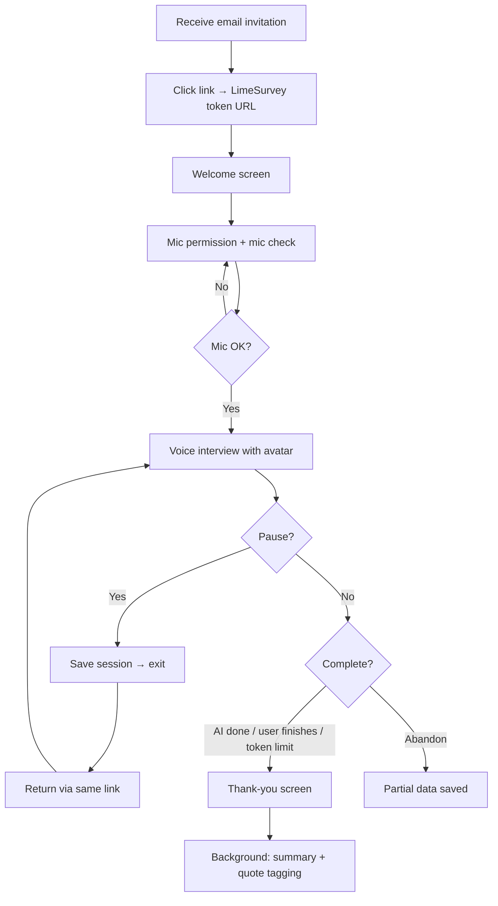

# AI Interviewer — Product Specification

**Version:** 0.1 (draft)  
**Date:** 2026-06-16  
**Deployment target:** LimeSurvey 6.x at `https://forms.aisurvey.eu/`  
**Base codebase:** AIInterview plugin v1.11.0 (chat-based question type)  
**Pilot target:** One 360° feedback project, ~20 participants  

---

## 1. Product vision

AI Interviewer is a LimeSurvey 6.x plugin that conducts **voice-first qualitative interviews** with respondents. The AI asks questions according to an administrator-defined script, probes for depth, records a transcript, and produces structured outputs (summary + competency-tagged quotes). Administrators manage projects, participants, invitations, and exports inside LimeSurvey.

**v1 success criteria:**
- Smooth spoken conversation between AI interviewer and respondent
- Reliable storage of transcript, summary, and tagged quotes
- Works on desktop and mobile browsers within the existing LimeSurvey deployment

---

## 2. Scope boundaries

### In scope (MVP)
- Voice input (respondent speaks; questions displayed on screen)
- Static avatar images (idle / listening / speaking / thinking)
- Pause and resume interview via same invitation link
- English + Polish per project
- Script with mandatory questions, probing depth, intro/outro, competency model reference
- Anonymity modes: named, confidential, anonymous (n ≥ 5 rule for anonymous reports)
- Bulk invite + configurable reminder
- CSV export (participants + quotes)
- GDPR: EU-hosted speech, configurable retention, manual delete
- Roles: super-admin, project admin, viewer-only

### Out of scope (MVP)
- AI voice output (TTS) — questions are shown as text
- Zoom / teleconference integration
- Animated or lip-sync avatar
- PDF reports, thematic clustering dashboard
- Multi-tenant SaaS (architecture should allow it later; v1 is single-org)

---

## 3. User roles and permissions

| Capability | Super-admin | Project admin | Viewer |
|------------|:-----------:|:-------------:|:------:|
| Plugin global settings (API keys, EU region) | ✓ | — | — |
| Create / delete LimeSurvey surveys (projects) | ✓ | ✓ | — |
| Configure interview script & avatar | ✓ | ✓ | — |
| Manage participants (tokens / emails) | ✓ | ✓ | — |
| Send invitations & reminders | ✓ | ✓ | — |
| View individual transcripts (named/confidential) | ✓ | ✓ | ✓* |
| View anonymous responses (aggregated only if n < 5) | ✓ | ✓ | ✓* |
| Export CSV | ✓ | ✓ | ✓ |
| Delete interview data | ✓ | ✓ | — |
| Close / archive project | ✓ | ✓ | — |

\*Viewer access respects anonymity mode: in anonymous mode, viewers never see participant identifiers linked to responses.

**Implementation note:** Map roles to LimeSurvey permissions (`superadmin`, survey-specific `surveycontent` + custom plugin permission `aiinterview_view` / `aiinterview_admin`).

---

## 4. Conceptual model

### Project = LimeSurvey survey
Each research project is a LimeSurvey survey containing one **AI Interview** question (existing question type, extended for voice). LimeSurvey provides:
- Token-based participant access
- Email invitation and reminder infrastructure
- Response storage (transcript in answer field)
- User/role management

### Plugin extensions
The plugin adds:
- Survey-level **Interview Settings** (script metadata, anonymity, probing, avatar, retention)
- Custom DB tables for sessions, summaries, tagged quotes, token usage
- **Voice interview UI** (replaces text chat input)
- **Results dashboard** inside LimeSurvey admin
- Post-interview **AI analysis** job (summary + quote tagging)

---

## 5. Respondent journey



### R1 — Invitation
- Respondent receives email from LimeSurvey with personalized link:  
  `https://forms.aisurvey.eu/index.php/{surveyId}?token={token}`
- Email content is configurable per project (subject, body, placeholders: `{FIRSTNAME}`, `{SURVEYURL}`, `{DEADLINE}`).

### R2 — Welcome screen
- Shows: project title, estimated duration (5–30 min), privacy statement (based on anonymity mode), brief instructions (“You will speak your answers; questions appear on screen”).
- Primary CTA: **Start interview**
- Secondary: **Continue later** (if session exists, show **Resume interview**)

### R3 — Microphone check
- Browser prompts for microphone access (single permission on LimeSurvey page).
- Visual: avatar in *idle* state, waveform or level meter, “Say a few words to test your microphone.”
- Retry guidance if blocked (browser settings, use Chrome/Safari, headphones recommended).
- Mobile: full-width layout, large tap targets.

### R4 — Interview screen (core)
Layout (desktop and mobile):

```
┌─────────────────────────────────────────┐
│  [Avatar image — state: idle/listening/ │
│   speaking/thinking]                    │
│                                         │
│  Current question (large readable text) │
│  ─────────────────────────────────────  │
│  Live transcript scroll (optional toggle)│
│                                         │
│  ● Listening… / Tap to speak / Processing│
│                                         │
│  [Pause & continue later]  [Finish]     │
└─────────────────────────────────────────┘
```

**Interaction model (v1):**
- **Auto end-of-utterance:** microphone listens; when respondent stops speaking (~1.5 s silence), audio is sent for transcription.
- Fallback: **Hold to speak** button if auto-VAD fails on device.
- Avatar states:
  - *idle* — waiting to start turn
  - *listening* — mic active, respondent speaking
  - *thinking* — STT + LLM in progress
  - *speaking* — AI question displayed (static image variant while text appears)

**Conversation rules:**
- AI follows script: intro → questions → probes (admin-configured max) → outro
- Mandatory questions flagged in script cannot be skipped
- Tone: warm coach (default, configurable in script)
- Language: project setting (`en` or `pl`)

### R5 — Pause and resume
- **Pause & continue later** persists session to plugin session table.
- Same token URL resumes at last unanswered question.
- Partial transcript saved on every completed turn.

### R6 — Completion
Interview marked **complete** when any of:
1. AI concludes (all mandatory topics covered + outro delivered)
2. Respondent clicks **Finish interview**
3. Token budget exhausted (warning shown, graceful end)
4. Admin closes project (in-progress sessions finish current turn then lock)

Post-completion: thank-you screen; no further edits allowed.

### R7 — Abandoned interviews
- Status: `in_progress` with partial transcript retained.
- Eligible for reminder email.
- Admin can view partial data (respecting anonymity mode).

---

## 6. Administrator journey

### A1 — Plugin settings (super-admin)
**Path:** Admin → Configuration → Plugin Manager → AIInterview → Settings

| Setting | Description |
|---------|-------------|
| Azure Speech key / region | EU region (e.g. `westeurope`, `polandcentral`) |
| LLM provider | Azure OpenAI (EU) or OpenAI with DPA |
| LLM API key / endpoint | Server-side only |
| Default model | e.g. `gpt-4o` |
| Session encryption key | For pause/resume tokens |
| Default avatar pack | Upload path for image sets |

### A2 — Project list
**Path:** Admin → AI Interviewer → Projects  
(lists LimeSurvey surveys where AI Interview question exists or flag `ai_interview_enabled`)

Columns: Name, Status (draft/active/closed), Participants, Completed, Completion %, Created, Actions.

Actions: Open, Duplicate, Close, Delete data, Export CSV.

### A3 — Project configuration
**Path:** Survey settings → AI Interview tab (or plugin menu → Edit project)

#### General
- Project name, description, status
- Language: English / Polish
- Expected duration (display only)
- Anonymity mode: Named | Confidential | Anonymous
- Minimum group size for anonymous reports (default: 5)
- Data retention date (auto-delete) + manual delete button

#### AI & cost
- Model override (optional)
- Max token budget per interview (default: 6000, inherits from question attribute if unset)
- Probing depth: default max follow-ups (1–3)

#### Script
Structured editor with sections:
- **Research brief** — context for analysis (competency model, themes)
- **Interviewer instructions** — behavior, tone, start/end rules
- **Question list** — text, mandatory flag, optional probe hints
- **Analysis instructions** — how to tag quotes to competencies/themes

*(MVP may use a single textarea — existing `ai_interview_prompt` — plus optional JSON block for structured questions; see backlog.)*

#### Avatar
- Upload 4 static images: idle, listening, thinking, speaking
- Interviewer display name (e.g. “Alex”)
- Preview panel

#### Participants
- Import CSV (email, first name, last name, custom attributes)
- Sync with LimeSurvey tokens (create/update tokens)
- Status per participant: not invited | invited | in progress | complete | expired

#### Email templates
- Invitation (bulk send)
- Reminder (single template; schedule: days after invite, days before deadline)
- Placeholders documented inline

#### Results
- Table: one row per participant (see §7)
- Drill-down: transcript, summary, tagged quotes
- Export CSV (participants + separate quotes CSV)
- Anonymous mode: hide name/email columns in export; suppress row-level view until n ≥ 5 for aggregate-only widgets

---

## 7. Data outputs

### Master table (one row per participant)

| Column | Description |
|--------|-------------|
| participant_id | Internal ID (hidden in anonymous mode exports) |
| token | LimeSurvey token |
| email | Hidden in anonymous exports |
| status | not_started / in_progress / complete / abandoned |
| started_at | Timestamp |
| completed_at | Timestamp |
| duration_seconds | Interview length |
| transcript | Full text |
| summary | AI-generated executive summary |
| tokens_used | LLM token count |
| language | en / pl |
| anonymity_mode | Snapshot at completion |

### Tagged quotes table (many rows per participant)

| Column | Description |
|--------|-------------|
| quote_id | |
| participant_id | FK (nullable in anonymous storage) |
| quote_text | Verbatim excerpt |
| theme / competency | From research brief |
| source_question | Script question reference |
| turn_index | Position in transcript |

### CSV exports
1. **participants.csv** — master table columns (respecting anonymity)
2. **quotes.csv** — all tagged quotes with theme/competency

---

## 8. User stories

### Epic E1 — Voice interview (respondent)

| ID | Story | Acceptance criteria |
|----|-------|---------------------|
| US-R01 | As a respondent, I open my invitation link and see clear instructions | Welcome screen shows duration, privacy note, start button |
| US-R02 | As a respondent, I grant microphone access once and verify it works | Mic check passes/fails with actionable errors |
| US-R03 | As a respondent, I answer by speaking instead of typing | Speech transcribed to text; no typed input required for answers |
| US-R04 | As a respondent, I see the current question on screen while the avatar is visible | Question text updates; avatar state changes |
| US-R05 | As a respondent, I can pause and resume later | Same link restores session and transcript |
| US-R06 | As a respondent, I know when the interview is finished | Clear end state; cannot accidentally overwrite answers |
| US-R07 | As a respondent, I can complete the interview on my phone | Responsive layout; mic works on mobile Safari/Chrome |

### Epic E2 — Project administration

| ID | Story | Acceptance criteria |
|----|-------|---------------------|
| US-A01 | As a project admin, I create a project with script and competency model | Script saved; appears in AI system prompt |
| US-A02 | As a project admin, I set anonymity mode per project | Mode enforced in UI and exports |
| US-A03 | As a project admin, I upload participant emails and send bulk invites | Tokens created; emails sent via LimeSurvey |
| US-A04 | As a project admin, I configure one reminder schedule | Reminder sent only to non-complete participants |
| US-A05 | As a project admin, I set token budget and probing depth | Interview ends or stops probing per config |
| US-A06 | As a project admin, I upload avatar images | Four states display correctly in interview |
| US-A07 | As a project admin, I view all results in one table | Sortable/filterable; status visible |
| US-A08 | As a project admin, I export CSV | Two files; anonymity rules applied |
| US-A09 | As a project admin, I set retention and delete data | Auto-delete job runs; manual delete immediate |
| US-A10 | As a project admin, I close a project | New sessions blocked; existing complete gracefully |

### Epic E3 — Analysis & compliance

| ID | Story | Acceptance criteria |
|----|-------|---------------------|
| US-C01 | As a project admin, I receive AI summary per completed interview | Summary stored within 2 min of completion |
| US-C02 | As a project admin, I receive quotes tagged to competencies | At least one tag per relevant quote; themes from brief |
| US-C03 | As a super-admin, API keys never appear in browser | Network tab shows no secrets |
| US-C04 | As a DPO, speech audio is processed in EU | Azure region configured; documented in admin |
| US-C05 | As a viewer, I see results read-only | No edit/send/delete permissions |

---

## 9. Screen inventory

### Respondent screens (within LimeSurvey survey theme)

| # | Screen | Key elements |
|---|--------|--------------|
| S-R1 | Welcome | Title, privacy badge, duration, Start / Resume |
| S-R2 | Mic check | Avatar idle, level meter, Test mic, Continue |
| S-R3 | Interview | Avatar, question text, status indicator, transcript toggle, Pause, Finish |
| S-R4 | Paused confirmation | “Resume anytime using your link” |
| S-R5 | Complete | Thank you, optional redirect |
| S-R6 | Error | Service unavailable, retry, contact admin |

### Admin screens (LimeSurvey admin UI)

| # | Screen | Key elements |
|---|--------|--------------|
| S-A1 | Plugin settings | EU API keys, defaults |
| S-A2 | Project list | Table, filters, actions |
| S-A3 | Project — General | Name, status, language, anonymity, retention |
| S-A4 | Project — Script | Prompt editor, question list, mandatory flags |
| S-A5 | Project — Avatar | Image upload ×4, preview |
| S-A6 | Project — Participants | Import, token sync, status |
| S-A7 | Project — Emails | Invitation + reminder templates, send actions |
| S-A8 | Project — Results | Master table, drill-down, export |
| S-A9 | Participant detail | Transcript, summary, quotes |
| S-A10 | Anonymous aggregate | Summary stats only when n < 5 |

---

## 10. Non-functional requirements

| Area | Requirement |
|------|-------------|
| Performance | First AI response ≤ 5 s p95; STT latency ≤ 3 s p95 for 30 s utterance |
| Availability | Same SLA as LimeSurvey instance |
| Browsers | Latest Chrome, Edge, Safari (desktop + iOS) |
| GDPR | EU speech processing; data minimization; retention enforcement; audit log for admin deletes |
| Security | HTTPS only; CSRF on all plugin endpoints; session-bound voice API |
| Scale (pilot) | 20 participants, ≤5 concurrent |
| Scale (target) | 6000 participants, 1000 concurrent (architecture must not block this) |

---

## 11. Relationship to existing plugin

The current AIInterview plugin (v1.11.0) provides:
- AI Interview question type (extends Long Free Text)
- Server-side OpenAI proxy (`plugins/direct?function=chat`)
- Per-question prompt, token budget, mandatory flag
- Chat UI with transcript stored in answer field

**v2 evolution (this spec):**
- Replace chat input with voice capture + EU STT
- Add avatar display
- Add plugin DB tables for sessions, summaries, quotes
- Add admin UI for project settings, exports, anonymity
- Keep LimeSurvey tokens, emails, and response storage as foundation
- Post-interview analysis pipeline for summary + quote tagging

---

## 12. Open questions (post-draft)

1. Should incomplete interviews allow **one-click “submit partial”** for respondents, or only admin visibility?
2. For Polish: STT locale `pl-PL` only, or also support mixed PL/EN utterances?
3. Branding: use LimeSurvey survey theme only, or plugin-specific minimal chrome for interview screens?

---

*Document maintained in `docs/ai-interviewer/`. Next: see `02-technical-architecture.md` and `03-mvp-backlog.md`.*
