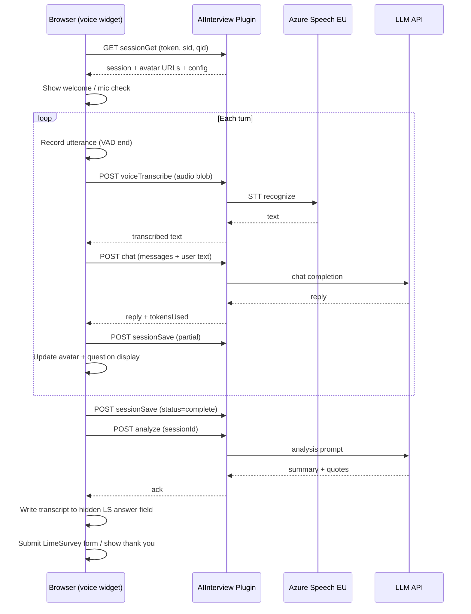

# AI Interviewer — Technical Architecture

**Version:** 0.1 (draft)  
**Date:** 2026-06-16  
**Target:** LimeSurvey 6.x @ `https://forms.aisurvey.eu/`  
**Existing plugin:** AIInterview v1.11.0  

---

## 1. Architecture summary

AI Interviewer extends the existing LimeSurvey plugin with a **voice interview layer** while keeping LimeSurvey as the system of record for participants, invitations, and permissions.

```
┌─────────────────────────────────────────────────────────────────────────┐
│                     https://forms.aisurvey.eu                            │
├─────────────────────────────────────────────────────────────────────────┤
│  LimeSurvey 6.x Core                                                    │
│  ├── Surveys / tokens / email / responses                               │
│  └── Admin UI + permissions                                             │
├─────────────────────────────────────────────────────────────────────────┤
│  AIInterview Plugin (PHP, extends PluginBase)                           │
│  ├── Question theme + voice widget (JS)                                 │
│  ├── Admin controllers (projects, results, export)                      │
│  ├── Custom tables (sessions, summaries, quotes)                        │
│  ├── REST-ish direct endpoints (session, voice, chat, analyze)          │
│  └── Background jobs (reminders, retention, analysis)                 │
├─────────────────────────────────────────────────────────────────────────┤
│  Optional: Voice Sidecar (Node.js) — same host, reverse-proxied         │
│  └── WebSocket STT streaming if PHP long-polling insufficient         │
└─────────────────────────────────────────────────────────────────────────┘
          │                              │
          ▼                              ▼
   Azure Speech (EU)              Azure OpenAI / OpenAI (EU)
   STT: westeurope / polandcentral     LLM + post-interview analysis
```

**Deployment choice for v1:** Start with **PHP-only** voice flow (browser records audio blob → plugin endpoint → Azure STT batch) to avoid operating a separate service on day one. Add Node WebSocket sidecar in Phase 2 if latency requires it. Both options use the same API contract below.

---

## 2. Design principles

1. **Same origin** — Interview runs on `forms.aisurvey.eu`; no third-party iframe that re-prompts mic.
2. **Secrets server-side only** — Pattern established in existing `handleChatRequest()`.
3. **LimeSurvey session is auth** — Voice endpoints require active `$_SESSION['survey_{sid}']` or valid pause token.
4. **Progressive enhancement** — Chat/text fallback retained from v1.11 for debugging and accessibility escape hatch (admin-only flag).
5. **EU data path** — Azure Speech in EU region; LLM via Azure OpenAI EU deployment where possible.

---

## 3. Component breakdown

### 3.1 LimeSurvey plugin (`plugins/AIInterview/`)

| Module | Responsibility |
|--------|----------------|
| `AIInterview.php` | Events, endpoints, OpenAI/Azure clients |
| `models/` | ActiveRecord for plugin tables |
| `controllers/` | Admin UI (extends LS admin layout) |
| `assets/ai-interview-voice.js` | Voice UI, VAD, avatar states, session sync |
| `assets/ai-interview-voice.css` | Respondent + avatar layout |
| `views/admin/` | Project settings, results dashboard |
| `migrations/` | Plugin table schema |
| `question_themes/AIInterview/` | Twig template (voice widget shell) |

### 3.2 Browser client (voice widget)

- `MediaRecorder` API → WebM/Opus chunks or full utterance blob
- Optional: Web Audio API for level meter + simple VAD (silence detection)
- Avatar `` swapped by `data-state`
- Communicates with plugin via existing `plugins/direct` + new functions
- Stores turn-by-turn state in plugin session table (not only hidden textarea)

### 3.3 External services (EU)

| Service | Purpose | Region |
|---------|---------|--------|
| Azure Speech-to-Text | Transcribe respondent audio | `westeurope` or `polandcentral` |
| Azure OpenAI (preferred) or OpenAI | Conversation + analysis | EU deployment / DPA |
| LimeSurvey mailer | Invitations, reminders | Existing |

---

## 4. Database schema (plugin tables)

All tables prefixed `{{ai_interview_}}` (LimeSurvey table prefix applied).

### 4.1 `ai_interview_project`

Survey-level settings (1:1 with `surveys.sid`).

```sql
CREATE TABLE ai_interview_project (
  id              INT AUTO_INCREMENT PRIMARY KEY,
  sid             INT NOT NULL UNIQUE,
  anonymity_mode  ENUM('named','confidential','anonymous') DEFAULT 'confidential',
  min_group_size  INT DEFAULT 5,
  language        VARCHAR(10) DEFAULT 'en',
  probing_max     TINYINT DEFAULT 2,
  retention_date  DATE NULL,
  avatar_idle     VARCHAR(255) NULL,
  avatar_listening VARCHAR(255) NULL,
  avatar_thinking  VARCHAR(255) NULL,
  avatar_speaking  VARCHAR(255) NULL,
  interviewer_name VARCHAR(100) DEFAULT 'Alex',
  research_brief  TEXT NULL,
  analysis_prompt TEXT NULL,
  reminder_days   INT DEFAULT 3,
  status          ENUM('draft','active','closed') DEFAULT 'draft',
  created_at      DATETIME,
  updated_at      DATETIME
);
```

### 4.2 `ai_interview_session`

Pause/resume and progress tracking (1:1 with token response in flight).

```sql
CREATE TABLE ai_interview_session (
  id              INT AUTO_INCREMENT PRIMARY KEY,
  sid             INT NOT NULL,
  token           VARCHAR(36) NOT NULL,
  qid             INT NOT NULL,
  status          ENUM('not_started','in_progress','complete','abandoned') DEFAULT 'not_started',
  conversation_json MEDIUMTEXT NULL,  -- OpenAI messages array
  transcript      MEDIUMTEXT NULL,
  tokens_used     INT DEFAULT 0,
  current_q_index INT DEFAULT 0,
  pause_token     VARCHAR(64) NULL UNIQUE,
  started_at      DATETIME NULL,
  updated_at      DATETIME NULL,
  completed_at    DATETIME NULL,
  UNIQUE KEY (sid, token, qid)
);
```

### 4.3 `ai_interview_result`

Post-interview analysis (1:1 per completed session).

```sql
CREATE TABLE ai_interview_result (
  id              INT AUTO_INCREMENT PRIMARY KEY,
  session_id      INT NOT NULL UNIQUE,
  sid             INT NOT NULL,
  summary         TEXT NULL,
  analysis_json   MEDIUMTEXT NULL,
  analyzed_at     DATETIME NULL,
  FOREIGN KEY (session_id) REFERENCES ai_interview_session(id) ON DELETE CASCADE
);
```

### 4.4 `ai_interview_quote`

Tagged quotes for export.

```sql
CREATE TABLE ai_interview_quote (
  id              INT AUTO_INCREMENT PRIMARY KEY,
  result_id       INT NOT NULL,
  quote_text      TEXT NOT NULL,
  theme           VARCHAR(255) NULL,
  competency      VARCHAR(255) NULL,
  source_question VARCHAR(500) NULL,
  turn_index      INT NULL,
  FOREIGN KEY (result_id) REFERENCES ai_interview_result(id) ON DELETE CASCADE
);
```

### 4.5 LimeSurvey native storage (unchanged)

- **Answer field:** Full transcript in SGQA text column (compatibility with LS exports)
- **Tokens:** Participant email, send date, completion
- **Plugin settings:** Global API keys (`DbStorage`)

---

## 5. API contract

Base URL: `https://forms.aisurvey.eu/index.php/plugins/direct`

Common parameters: `plugin=AIInterview&function={function}`

### 5.1 Authentication matrix

| Endpoint | Auth requirement |
|----------|------------------|
| `chat` | Active LS survey session OR admin preview |
| `voiceTranscribe` | Active LS survey session OR valid `pause_token` |
| `sessionGet` / `sessionSave` | Active LS survey session |
| `sessionResume` | `pause_token` in query string |
| `analyze` | Internal/cron OR admin |
| Admin CRUD | LS admin permission + plugin permission |
| `export` | Admin/viewer with export permission |

All POST requests: `YII_CSRF_TOKEN` + `application/x-www-form-urlencoded` (matches existing v1.11 pattern).

---

### 5.2 `POST function=chat` (existing — extended)

**Purpose:** LLM turn — send conversation history, receive interviewer reply.

**Request body:** `payload` = JSON

```json
{
  "surveyId": 123456,
  "qid": 789,
  "token": "abc123token",
  "messages": [
    { "role": "system", "content": "..." },
    { "role": "assistant", "content": "..." },
    { "role": "user", "content": "..." }
  ],
  "maxTokens": 6000,
  "language": "en",
  "tokensUsedSoFar": 1200
}
```

**Response 200:**

```json
{
  "reply": "Thank you for sharing that. Can you tell me more about...",
  "tokensUsed": 245,
  "finishReason": "stop",
  "interviewComplete": false,
  "mandatoryRemaining": ["q3_leadership"]
}
```

**Changes from v1.11:**
- Add `qid`, `token` for session persistence
- Add `tokensUsedSoFar` for cumulative budget check
- Return `interviewComplete` and `mandatoryRemaining` parsed from structured script (Phase 2)

---

### 5.3 `POST function=voiceTranscribe` (new)

**Purpose:** Accept audio utterance; return EU-hosted STT text.

**Request:** `multipart/form-data`

| Field | Type | Description |
|-------|------|-------------|
| `audio` | file | WebM/Opus or WAV, max 25 MB |
| `surveyId` | int | |
| `token` | string | LimeSurvey participant token |
| `language` | string | `en` or `pl` → Azure locale `en-GB`/`en-US`, `pl-PL` |
| `YII_CSRF_TOKEN` | string | |

**Response 200:**

```json
{
  "text": "I think my manager gives clear direction most of the time.",
  "confidence": 0.92,
  "durationMs": 8400
}
```

**Errors:** `400` invalid audio, `403` no session, `502` Azure error

**Server implementation:**

```php
// Pseudocode
$locale = $language === 'pl' ? 'pl-PL' : 'en-GB';
$text = AzureSpeechClient::recognizeOnce($audioPath, $locale, $region, $apiKey);
```

Audio files are **not stored** by default (GDPR minimization); temp file deleted after transcription.

---

### 5.4 `POST function=sessionSave` (new)

**Purpose:** Persist conversation state for pause/resume and partial saves.

**Request payload:**

```json
{
  "surveyId": 123456,
  "qid": 789,
  "token": "abc123token",
  "status": "in_progress",
  "conversation": [...],
  "transcript": "Interviewer: Hello...\nRespondent: ...",
  "tokensUsed": 1200,
  "currentQIndex": 2
}
```

**Response 200:**

```json
{
  "saved": true,
  "pauseToken": "64-char-hex",
  "resumeUrl": "https://forms.aisurvey.eu/index.php/123456?token=abc123token&ai_resume=64-char-hex"
}
```

Also writes transcript to hidden answer field via client-side update (existing LS form behavior).

---

### 5.5 `GET function=sessionGet` (new)

**Purpose:** Load existing session on page load.

**Query:** `surveyId`, `token`, `qid`

**Response 200:**

```json
{
  "exists": true,
  "status": "in_progress",
  "conversation": [...],
  "transcript": "...",
  "tokensUsed": 1200,
  "currentQIndex": 2,
  "avatarUrls": {
    "idle": "/upload/ai_interview/123/idle.png",
    "listening": "...",
    "thinking": "...",
    "speaking": "..."
  },
  "projectConfig": {
    "interviewerName": "Alex",
    "language": "en",
    "maxTokens": 6000,
    "probingMax": 2,
    "anonymityMode": "confidential"
  }
}
```

---

### 5.6 `POST function=analyze` (new)

**Purpose:** Generate summary + tagged quotes after completion.

**Trigger:** Client calls once on `interviewComplete`; also cron retry if failed.

**Request payload:**

```json
{
  "sessionId": 42,
  "surveyId": 123456
}
```

**Response 200:**

```json
{
  "summary": "The respondent described...",
  "quotes": [
    {
      "quoteText": "She always follows up within a day.",
      "theme": "Communication",
      "competency": "Timely feedback",
      "sourceQuestion": "How does your manager communicate priorities?",
      "turnIndex": 4
    }
  ]
}
```

Server persists to `ai_interview_result` and `ai_interview_quote`.

**LLM prompt inputs:** `research_brief`, `analysis_prompt`, full transcript, script question list.

---

### 5.7 Admin endpoints (new)

| Function | Method | Purpose |
|----------|--------|---------|
| `adminProjects` | GET | List projects |
| `adminProjectSave` | POST | Save project settings |
| `adminParticipantsImport` | POST | CSV → tokens |
| `adminSendInvites` | POST | Bulk invitation |
| `adminSendReminders` | POST | Non-complete only |
| `adminResults` | GET | Paginated results table |
| `adminExport` | GET | CSV download |
| `adminDeleteData` | POST | GDPR delete |

All require LS admin session + `aiinterview_admin` or viewer for read-only endpoints.

---

## 6. Voice interview sequence



---

## 7. Script format (structured config)

MVP uses extended prompt text; Phase 2 adds JSON block embedded in question attribute `ai_interview_script_json`:

```json
{
  "intro": "Welcome the respondent warmly...",
  "outro": "Thank them and instruct to press Finish...",
  "tone": "warm_coach",
  "questions": [
    {
      "id": "q1",
      "text": "What is working well in your relationship with your manager?",
      "mandatory": true,
      "probeHints": ["Can you give a recent example?"]
    },
    {
      "id": "q2",
      "text": "What could your manager do differently?",
      "mandatory": true,
      "probeHints": []
    }
  ],
  "competencyModel": [
    { "id": "comm", "name": "Communication", "description": "..." },
    { "id": "lead", "name": "Leadership", "description": "..." }
  ]
}
```

PHP composes final system prompt:

```
{language instruction}
{tone instruction}
{research_brief}
{competency model}
{question list with mandatory flags}
{probing rules: max N, +1 if answer < 20 words}
{intro/outro instructions}
```

---

## 8. Anonymity implementation

| Mode | Token ↔ result link | Admin UI | Export |
|------|---------------------|----------|--------|
| Named | Full | Show email, name | All columns |
| Confidential | Full | Role-restricted | All columns; audit logged |
| Anonymous | On completion: delete `token` from session row; quotes/results use `anonymous_id` hash only | Hide identity columns | No email; participant_id is pseudonym |

**Anonymous n ≥ 5 gate:** Admin aggregate views check `COUNT(complete) >= min_group_size` before showing quote-level drill-down.

---

## 9. Integration with LimeSurvey features

### Participants & invitations
- Use **Survey → Participant tokens** as source of truth
- Plugin `adminSendInvites` calls LimeSurvey token API / uses `{SURVEYURL}` in email template
- Reminder: cron job queries tokens where `completed != 'Y'` and `reminder_sent != 1`

### Roles
- Register plugin permissions in `init()` via `newUserPermissions`
- Map: super-admin → LS superadmin; project admin → survey admin; viewer → custom read-only

### Theming
- Voice widget CSS scoped under `.ai-interview-voice-widget`
- Inherits survey theme wrapper; full-screen interview mode via optional survey theme flag

### Existing question type
- Keep `question_type = T` storage
- Widget mode selected by question attribute `ai_interview_mode`: `voice` | `chat` (default `voice` for new questions)

---

## 10. File / URL layout on forms.aisurvey.eu

```
/limesurvey/
  plugins/AIInterview/          # Plugin root
  upload/ai_interview/
    {sid}/avatars/              # Per-project avatar images
  index.php                     # Standard LS entry
```

**Respondent URL (unchanged):**

```
https://forms.aisurvey.eu/index.php/123456?token=XXXXXXXX
```

**Admin plugin UI:**

```
https://forms.aisurvey.eu/index.php/admin/aiinterview/projects
https://forms.aisurvey.eu/index.php/admin/aiinterview/project/sid/123456
```

*(Exact route depends on LS plugin admin registration pattern.)*

**Optional Phase 2 sidecar:**

```
https://forms.aisurvey.eu/ai-interview/ws   → proxy to localhost:3001
```

---

## 11. Background jobs

| Job | Schedule | Action |
|-----|----------|--------|
| `SendReminders` | Daily cron | Send reminder email per project config |
| `EnforceRetention` | Daily | Delete sessions/results past `retention_date` |
| `RetryAnalysis` | Hourly | Re-run failed `analyze` calls |
| `CloseExpiredProjects` | Daily | Set status=closed when past deadline |

Implement as LimeSurvey plugin cron hook or system cron calling `plugins/direct?function=cron&task=...` with shared secret.

---

## 12. Security checklist

- [x] API keys only in plugin settings (existing)
- [x] CSRF on POST (existing)
- [x] Survey session validation (existing)
- [ ] Rate limit `voiceTranscribe` per token (e.g. 120 req/hour)
- [ ] Max audio duration 120 s per utterance
- [ ] Pause token: HMAC-signed, expires in 30 days
- [ ] Admin delete: soft-delete + audit log entry
- [ ] Azure: disable speech logging / telemetry where configurable

---

## 13. Migration from v1.11 chat plugin

1. Install plugin update; run DB migrations
2. Existing surveys with AI Interview questions continue to work (`ai_interview_mode=chat`)
3. Admin enables voice per survey in AI Interview project settings
4. Global Azure Speech credentials added in plugin settings
5. Replace `ai-interview.js` with `ai-interview-voice.js` when mode=voice
6. No change to SGQA answer storage format (transcript text)

---

## 14. Phase 2 scaling notes (1000 concurrent)

- Move session state from MySQL row locks to Redis
- Queue STT/LLM requests with per-project rate limits
- Node WebSocket sidecar for streaming STT (lower latency)
- Horizontal LS app servers with sticky sessions or stateless JWT pause tokens
- Azure Speech committed capacity / PTU for OpenAI

---

## 15. Environment configuration

```env
# Plugin settings (stored in DB; env vars for self-hosted override)
AIINTERVIEW_AZURE_SPEECH_KEY=
AIINTERVIEW_AZURE_SPEECH_REGION=westeurope
AIINTERVIEW_AZURE_OPENAI_ENDPOINT=https://xxx.openai.azure.com/
AIINTERVIEW_AZURE_OPENAI_KEY=
AIINTERVIEW_AZURE_OPENAI_DEPLOYMENT=gpt-4o
AIINTERVIEW_CRON_SECRET=
```

---

*See `01-product-spec.md` for user-facing behavior and `03-mvp-backlog.md` for implementation order.*
